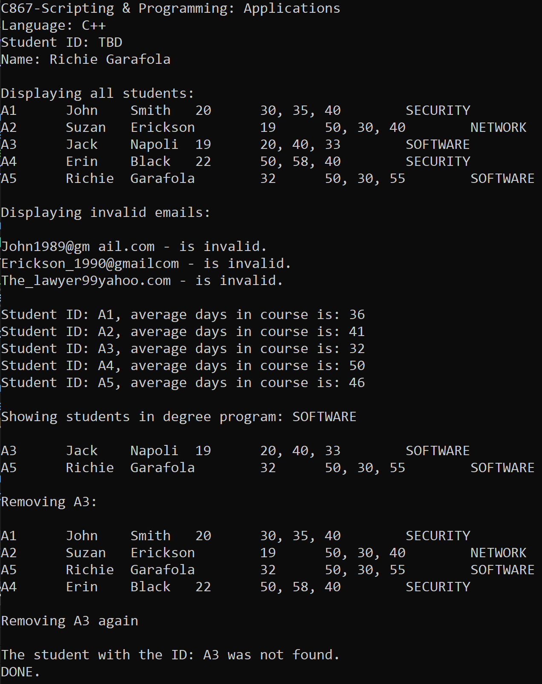

# Scripting and Programming - Applications - C867
# Richie Garafola

This program was created as an Performance Assessment assignment for Scripting and Programming - Applications - C867 through Western Governors University (WGU).

The code provided consists of three header files and three implementation files.

---

## The header files are:

**degree.h:** This file contains an enumerated data type called DegreeProgram that has three possible values: SECURITY, NETWORK, and SOFTWARE.

**student.h:** This file contains the class Student that has private member variables for studentID (string), firstName (string), lastName (string), studentEmail (string), studentAge (int), courseDays (vector<int>), and degree (DegreeProgram). It also includes public member functions for getters and setters, as well as a constructor, destructor, and a function to print student data.

**roster.h:** This file contains the class Roster that has private member variables classRosterArray (a pointer to an array of pointers to Student objects), rosterSize (int), and rosterIndex (int). It also has public member functions to add a student, remove a student, print all students, print the average number of days in a course for a particular student, print all invalid email addresses, and print all students in a particular degree program.

---

## The implementation files are:

**student.cpp:** This file contains the implementation of the member functions for the Student class.

**roster.cpp:** This file contains the implementation of the member functions for the Roster class, including utility functions for parsing data and validating email addresses.

**main.cpp:** This file contains the main function, which adds students to the roster, and performs various operations on the roster.

--- 

The main function is located in main.cpp. It creates an instance of the Roster class, reads in a list of student data, parses the data, creates Student objects, and adds them to the classRosterArray using the add function of the Roster class. After all the students have been added, it calls the other member functions of the Roster class to print out the required information.

The parseThenAddRow function of the Roster class is used to parse a row of student data and add the corresponding Student object to the classRosterArray. It uses stringstream and getline to parse the data and calls the add function to add the Student object to the classRosterArray.

The isValidEmail function of the Roster class is used to check if an email address is valid. It uses regular expressions to match the email address against a pattern and returns a boolean indicating whether the email address is valid or not.

The add function of the Roster class is used to add a Student object to the classRosterArray. It creates a new Student object using the input data and adds it to the classRosterArray.

The remove function of the Roster class is used to remove a Student object from the classRosterArray. It searches for the Student object with the given ID and removes it from the array.

The printAll function of the Roster class is used to print out the information of all the students in the classRosterArray. It loops through the array and calls the print function of each Student object.

The printAvgDaysInCourse function of the Roster class is used to print out the average number of days in a course for a particular student. It searches for the Student object with the given ID, calculates the average number of days, and prints it out.

The printInvalidEmails function of the Roster class is used to print out all the invalid email addresses

--- 

Together, these files implement a program that reads student data, stores the data in a Roster object, and provides various functions for manipulating and analyzing the data.

---

## To compile and run the program, follow these steps:

- Open the terminal/command prompt on your computer.

- Navigate to the directory containing the source code files.

- Compile the source code by typing g++ main.cpp student.cpp roster.cpp -o main and pressing Enter. This will generate an executable file named main.

- Run the program by typing ./main and pressing Enter. This will execute the program and output the required information to the console.
